# Sample Project for Meta-Transactions

This is the branch which is deployed on Ropsten and Netlify.
If you want to use this project local, go to the main branch and follow the instructions.

## Website

https://astounding-daifuku-0318c0.netlify.app/

## How does this work?

This is how the user interacts with the various components of this application.

### Participants

This is how the user interacts with the various components of this application.

The different components have been chosen with specific needs in mind:

* Frontend: This component displays the UI to the user and interacts with the backend.
* Backend: Has three main functionalities. First it stores the api access key to communicate with the node. Second, it prepares the message the user has to sign and third it stores a private key to sign transactions and pay the gas fees on behalf of the customer.
* Forwarder: Ensures that the incoming transaction gets validated before actually sent for execution. The forwarder also keeps a record of the internal nonces that external wallets are using while forwarding.
* Recipient: This is the final smart contract whose method is originally called from the Frontend. It substitutes the sender of the forwarder call for the actual sender (from) of the original transaction and persists the data on-chain.
* Node: This component is an Infura node and runs its own copy of the chain which the dApp can query from.

### Sequence Diagram

```mermaid
    sequenceDiagram
        autonumber
        participant User
        participant Metamask
        participant Frontend
        participant Backend
        participant Forwarder
        participant Recipient
        participant Node

        rect rgb(111, 160, 200, 0.2)
            note right of User: App startup
            rect rgb(111, 160, 200, 0.4)
                note right of User: Relayer information
                Frontend->>Backend: Request for information about the relayer
                Backend->>Node: Forward Request
                Node->>Backend: Send information
                Backend->>Frontend: Forward information
                Frontend->>User: Display information
            end

            rect rgb(111, 160, 200, 0.4)
                note right of User: All messages
                Frontend->>Backend: Request for all messages
                Backend->>Node: Forward Request
                Node->>Backend: Send information
                Backend->>Frontend: Forward information
                Frontend->>User: Display all messages
            end
        end

        note right of User: User sends message

        rect rgb(111, 160, 200, 0.2)
            note right of User: Send message to SC
            rect rgb(111, 160, 200, 0.4)
                note right of User: Metamask connection
                Frontend->>Metamask: Ask to connect to wallet.
                Metamask->>User: Ask for permission
                rect rgb(255,0,0, 0.6)
                    Note over User, Frontend: Break if permission is denied
                    Frontend->>User: show failure
                end
                Metamask->>Frontend: Send connected address
            end

            rect rgb(111, 160, 200, 0.4)
                note right of User: Network check
                Frontend->>Metamask: Ask for Users current network
                Metamask->>Frontend: Send network
                Frontend->>Frontend: Validates if network is Ropsten
                Frontend->>Metamask: if not Ropsten ask for network change
                Metamask->>User: Ask for permission
                rect rgb(255,0,0, 0.6)
                    Note over User, Frontend: Break if permission is denied
                    Frontend->>User: show failure
                end
            end

            rect rgb(111, 160, 200, 0.4)
                note right of User: Prepare Message to sign
                Frontend->>Backend: Request data to sign
                Backend->>Frontend: Send data to sign
                Frontend->>Metamask: Sign typed data
                Metamask->>User: Ask for permission
                rect rgb(255,0,0, 0.6)
                    Note over User, Frontend: Break if permission is denied
                    Frontend->>User: show failure
                end
            end

            rect rgb(111, 160, 200, 0.4)
                note right of User: Send to SC
                Frontend->>Backend: Send signature and request data
                Backend->>Backend: Validate signature
                rect rgb(255,0,0, 0.6)
                    Note over User, Backend: Break if signature is false
                    Backend->>Frontend: send failure
                    Frontend->>User: show failure
                end
                Backend->>Backend: Prepare signing of transaction
                Backend->>Forwarder: sign transaction for SC method executeDelegate on Forwarder
            end

        end
        rect rgb(111, 160, 200, 0.2)
            note right of User: SC Interaction
            rect rgb(111, 160, 200, 0.4)
                note right of User: Validate Signature
                Forwarder->>Forwarder: deconstruct the original sender out of the signature
                Forwarder->>Forwarder: validate that the original sender is equal to deconstructed sender and  <br/>the nonce of the message is equal to the nonce saved in the SC for the sender
                rect rgb(255,0,0, 0.6)
                    Note over Forwarder, Recipient: Break if validation fails
                    Forwarder->>Backend: send error
                    Backend->>Frontend: forward error
                    Frontend->>User: show error
                end
                Forwarder->>Forwarder: increase nonce for the sender
                Forwarder->>Recipient: call method with parameter specified by the user
            end
            rect rgb(111, 160, 200, 0.4)
                note right of User: Persist Message
                Recipient->>Recipient: Persist message with the address of the original sender
                Backend->>Frontend: Send Transaction Hash
                Frontend->>User: Show Etherscan link
                Backend->>Node: Ask for transaction Receipt
                Node->>Backend: Once mined send transaction receipt
                Recipient-->Recipient: Emit event
            end
        end
        rect rgb(111, 160, 200, 0.2)
            note right of User: Fetch data
            rect rgb(111, 160, 200, 0.4)
                note right of User: Relayer information
                Frontend->>Backend: Request for information about the relayer
                Backend->>Node: Forward Request
                Node->>Backend: Send information
                Backend->>Frontend: Forward information
                Frontend->>User: Display information
            end

            rect rgb(111, 160, 200, 0.4)
                note right of User: All messages
                Frontend->>Backend: Request for all messages
                Backend->>Node: Forward Request
                Node->>Backend: Send information
                Backend->>Frontend: Forward information
                Frontend->>User: Display all messages
            end
        end
```

