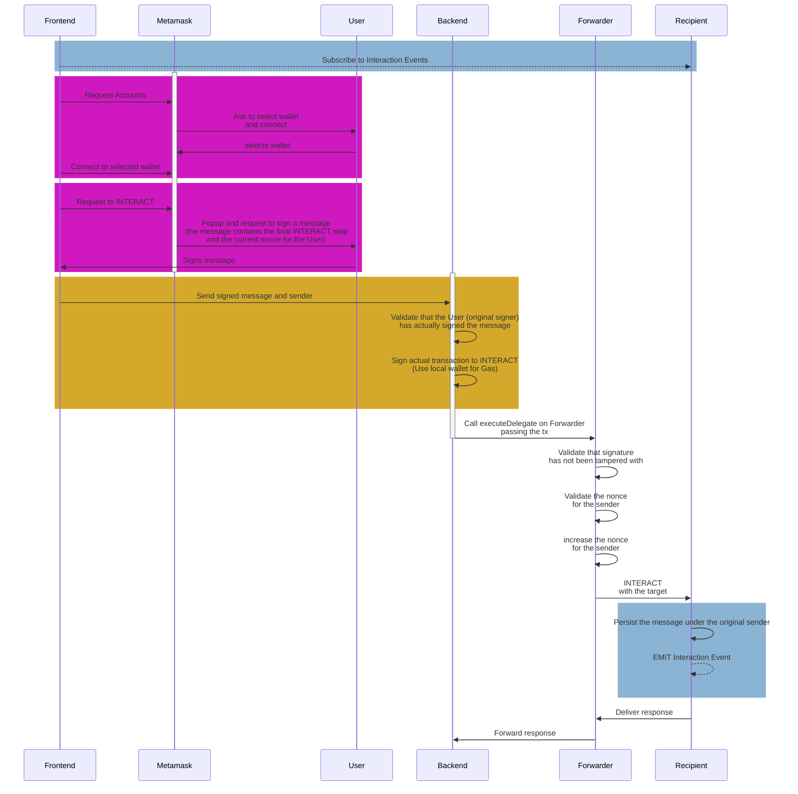

## Sequence Diagram

This is how the user interacts with the various components of this application.

The different components have been chosen with specific needs in mind:
* Backend: The backend is needed to protect the private key of the wallet that is doing the actual signing of the transactions on the blockchain.
* Forwarder: Ensures that the incoming transaction gets validated before actually sent for execution. The forwarder also keeps a record of the internal nonces that external wallets are using while forwarding.
* Recipient: This is the final smart contract whose method is originally called from the Frontend. It substitutes the forwarder sender for the actual sender (from) of the original transaction and persists the data on-chain.

